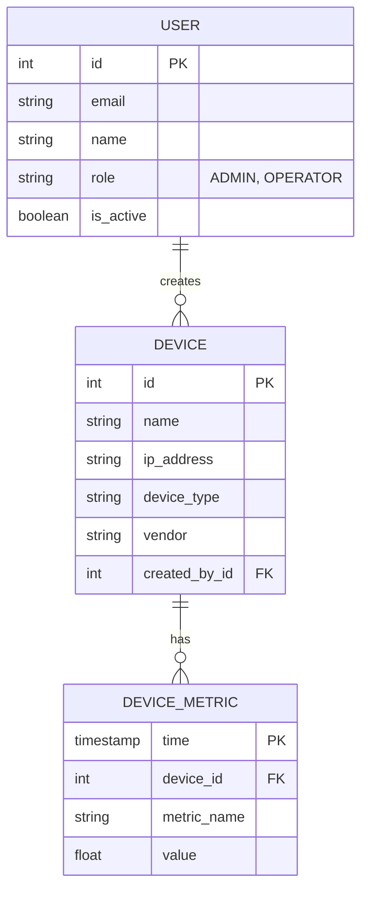

# Dokumentacja Schematu Bazy Danych

System SOTP wykorzystuje PostgreSQL do danych relacyjnych oraz TimescaleDB do danych telemetrycznych.

## Diagram ERD

## Opis Tabel

* **users**: Przechowuje konta użytkowników wraz z ich rolami (RBAC).
* **devices**: Inwentarz urządzeń sieciowych (routery, switche, serwery).
* **device_metrics**: Tabela TimescaleDB (hypertable) przechowująca historię wydajności (CPU, RAM).
