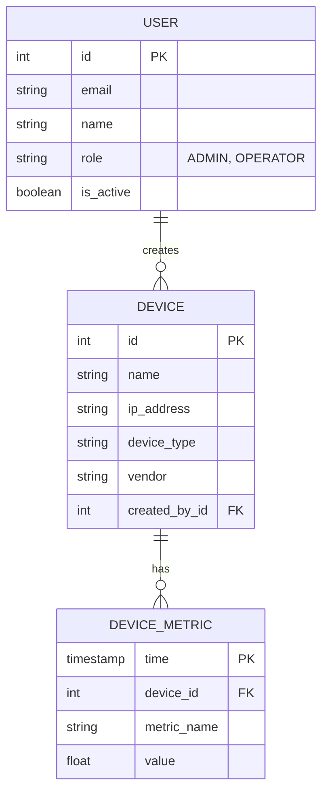

# Database Schema Documentation

The SOTP system utilizes PostgreSQL for relational inventory data and TimescaleDB for time-series telemetry data.

## ERD Diagram

```mermaid
erDiagram
    USER ||--o{ DEVICE : creates
    DEVICE ||--o{ DEVICE_METRIC : has

    USER {
        int id PK
        string email
        string name
        string role "ADMIN, OPERATOR"
        boolean is_active
    }

    DEVICE {
        int id PK
        string name
        string ip_address
        string device_type
        string vendor
        int created_by_id FK
    }

    DEVICE_METRIC {
        timestamp time PK
        int device_id FK
        string metric_name
        float value
    }

```

## Table Descriptions

* **users**: Stores user accounts along with role-based access control roles (RBAC).
* **devices**: Network device inventory (routers, switches, servers, firewalls).
* **device_metrics**: TimescaleDB hypertable storing historical performance metrics (CPU, RAM, RTT, etc.).
